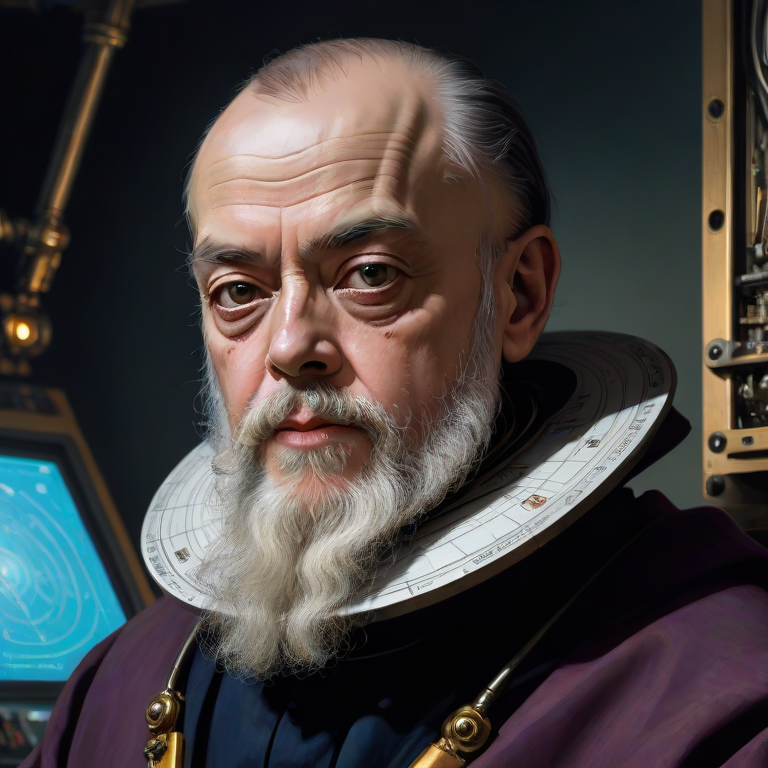

# Galileo (Mann-E's B2B Service) Documents

<p align="center">
    
</p>

## Examples

* [HTML/Vanilla JS](./examples/html)
* Python (Soon)
* React/Axios (Soon)

## API Docs

### Acquiring the token

To acquire a token, send an email to us at _haghiri75@gmail.com_ and we'll reach out to you as soon as possible with a proposal and also the more detailed guide. Although we tried to make this part of the docs a very neat and understandable document for everyone, but we also may provide support for our B2B customers.

### Verify the token 

__ENDPOINT__ : `/verify_token`
__METHOD__ : `POST`

Using a _curl_ command like this, you can verify that your token is valid or not. 

```bash
curl -X POST -k -H 'Content-Type: application/json' -i 'https://galileo.manne.ir/verify_token' --data '{
 "token": "manne-YOUR_TOKEN"
}'
``` 

The response from the server will be like this:

```json
{
  "message": "Your token is valid",
  "name": "Mann-E"
}
```

### Checking how much images left


### Creating an image

__ENDPOINT__ : `/images`
__METHOD__: `POST`

using the following curl command, you can create an image:

```bash
curl -X POST -k -H 'Content-Type: application/json' -H 'token: manne-YOUR_TOKEN' -i 'https://galileo.manne.ir/images' --data '{
 "prompt" : "a young beautiful woman with orange hair, standing in front of a tree, analog photo",
 "negative_prompt": "hands, arms",
 "style" : "nostyle",
 "ratio" : "1:1"
}'
```

And the result will be a json object like the following:

```json
{
  "prompt": "a young beautiful woman with orange hair, standing in front of a tree, analog photo",
  "negative_prompt": "hands, arms",
  "style": "nostyle",
  "image": "BASE64_ENCODED_IMAGE"
  "user": {
    "id": 1,
    "name": "Mann-E",
    "token": "manne-YOUR_TOKEN",
    "created_at": "2023-12-31T09:13:17.185Z",
    "updated_at": "2023-12-31T09:13:17.196Z"
  },
  "width": 768,
  "height": 768
}
```

#### API Parameters

1. `prompt` is the prompt which can result in an image. 
2. `negative_prompt` is like prompt, but the difference is what you put here _won't be_ in the resulting image. 
3. `style` is the style of the image. For more information please read [Style Guide](./STYLES.md).
4. `ratio`is the height/weight ratio of the image. Currently `1:1` (Square images), `9:16` (Portrait) and `16:9` (landscape) are supported.

#### Status Codes

### Listing all the images of your token

__ENDPOINT__ : `/images`
__METHOD__ : `GET`

Using the following curl command, you can have a json array of all the images you have made.

```bash
curl -X GET -k -H 'token: manne-YOUR_TOKEN' -i 'https://galileo.manne.ir/images'
```

### Getting a single image

__ENDPOINT__ : `/images/:id`
__METHOD__: `GET`

This is for a single image, and doesn't need a token. The curl request is like the following:

```bash
curl -X GET -k -i 'https://galileo.manne.ir/images/<IMAGE_ID>'
```

The response is identical to when you create an image.

## Help and Support

For getting help and support, stay in contact with the support email/number we provide in our proposal.